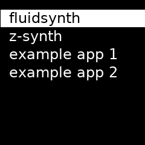

# rpi-adafruit-tasker

Basic app runner for Adafruit Mini PiTFT. Specifically [this one](https://www.adafruit.com/product/4484) (1.3" 240x240). Some modifications would be needed to support other displays. Using the python interfacing option as described [here](https://learn.adafruit.com/adafruit-mini-pitft-135x240-color-tft-add-on-for-raspberry-pi/python-setup).

Use buttons to switch apps. Text color indicates the status of the selected app. Exception colors: red for failed, grey for exited without error.



# Run Instructions

Create a virtual environment and install dependencies:
```
python3 -m venv venv
source venv/bin/activate
pip install -r requirements.txt.freeze
```

Run:
```
python main.py example-task-config.json
```

# Launch on Startup

Example of how to run at startup using [Supervisor](http://supervisord.org/index.html).

1. Install Supervisor
```
apt install supervisor
```

2. Add a config file

Note: this example runs the script from the same python virtual environment as above. Update the paths for your system.

`/etc/supervisor/conf.d/rpi_adafruit_tasker.conf`:
```
[program:rpi_adafruit_tasker]
command=/home/pi/git/rpi-adafruit-tasker/venv/bin/python /home/pi/git/rpi-adafruit-tasker/main.py /home/pi/git/rpi-adafruit-tasker/example-task-config.json
stderr_logfile=/var/log/rpi_adafruit_tasker.err.log
autostart=true
```

3. Reload supervisor

```
sudo supervisorctl reread
sudo supervisorctl update
```

You can now check the status with `sudo supervisorctl status` and start/stop/restart by e.g. `sudo supervisorctl restart rpi_adafruit_tasker`.
